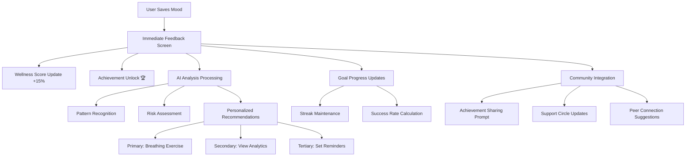

# 🌱 Happy Path - Mood Tracking Flow Demo

## 📋 Overview

This directory contains a complete mock implementation of the **mood tracking flow** that demonstrates what happens after a user saves their mood data in the Happy Path mental wellness platform.

## 🎯 What This Demonstrates

The complete user journey from mood entry to next steps, including:

1. **Immediate Feedback** - Instant wellness score updates and achievement notifications
2. **AI-Powered Insights** - Real-time mood analysis and pattern recognition
3. **Goal Progress Updates** - Automatic tracking and streak maintenance
4. **Personalized Recommendations** - Context-aware next steps and activities
5. **Community Integration** - Social features and peer support opportunities

## 📁 File Structure

```
src/
├── components/
│   ├── MoodSavedScreen.jsx          # Main post-mood-save interface
│   └── CommunityIntegrationScreen.jsx # Community features
├── mockData/
│   └── moodFlowMockData.js          # Comprehensive mock data
├── pages/
│   └── MoodFlowDemo.jsx             # Demo page with explanations
└── styles/
    ├── MoodSavedScreen.css          # Component styles
    └── MoodFlowDemo.css             # Demo page styles
```

## 🌟 Key Features Demonstrated

### 1. Immediate Value Delivery
- **Instant Feedback**: Success confirmation with visual celebrations
- **Wellness Score Update**: Real-time calculation showing +15% improvement
- **Achievement System**: Unlocking "Consistency Champion" for 5-day streak

### 2. AI-Powered Analysis
- **Pattern Recognition**: Sleep-mood correlation (0.82), exercise correlation (0.67)
- **Risk Assessment**: Low risk level with 95% confidence
- **Trend Analysis**: 7-day mood improvement trend

### 3. Personalized Recommendations
- **Primary Action**: 2-minute breathing exercise for presentation anxiety
- **Secondary Options**: Journal reflection, goal checking, community sharing
- **Contextual Suggestions**: Based on current mood (7/10) and anxiety level (mild)

### 4. Goal Progress Tracking
- **Daily Mood Check-ins**: 5/7 streak (100% success rate)
- **Anxiety Management**: 4/5 this week (75% success rate)  
- **Sleep Improvement**: 5/6 this week (85% success rate)

### 5. Community Features
- **Support Circle**: Young Professionals - Anxiety Support (127 members)
- **Achievement Sharing**: Anonymous success story sharing
- **Peer Connections**: Wellness buddy matching (87% compatibility with "Sam")

## 🔄 Complete User Flow



## 📊 Mock Data Structure

### Mood Entry Data
```javascript
{
  entryId: "mood_67890",
  userId: "user_12345",
  overallMood: 7,
  anxietyLevel: "mild",
  stressLevel: "moderate",
  energyLevel: "moderate",
  emotions: ["hopeful", "focused", "slightly_anxious"],
  triggers: ["work_presentation", "coffee"],
  copingStrategies: ["deep_breathing", "morning_walk"],
  notes: "Feeling more confident about presentation after practicing",
  wellnessScore: 73,
  scoreChange: +15
}
```

### AI Insights Response
```javascript
{
  immediate: {
    wellnessScore: 73,
    scoreChange: +15,
    riskLevel: "low",
    primaryRecommendation: {
      type: "breathing_exercise",
      title: "2-Minute Calm Breathing",
      description: "Based on your slight anxiety, try this proven technique"
    }
  },
  patterns: {
    sleepMoodCorrelation: 0.82,
    exerciseMoodCorrelation: 0.67,
    trendDirection: "improving",
    insights: [
      "Your mood tends to be 23% higher on days when you get 7+ hours of sleep",
      "Exercise shows a strong positive correlation with your mood"
    ]
  }
}
```

### Goal Progress Data
```javascript
{
  activeGoals: [
    {
      name: "Daily Mood Check-ins",
      currentStreak: 5,
      bestStreak: 5,
      successRate: 100,
      progress: { thisWeek: 5, target: 7 }
    }
  ]
}
```

## 🎨 Screen Mockups

### 1. Main Mood Saved Screen
- **Success confirmation** with animated checkmark
- **Wellness score update** with visual progress
- **Achievement notification** with celebration animation
- **Immediate insights** showing mood summary
- **Primary recommendation** with call-to-action
- **Quick analytics preview** with trend indicators

### 2. Breathing Exercise Screen
- **Guided interface** with animated breathing circle
- **Timer display** showing 2:00 countdown
- **Instruction text** with breathing patterns
- **Helpful tips** for effective practice

### 3. Detailed Analytics Screen
- **7-day mood trend** visualization
- **Correlation analysis** with strength indicators
- **Personal insights** from AI analysis
- **Goal progress** with visual progress bars

### 4. Reminder Setup Screen
- **Time selection** with user preferences
- **Message customization** options
- **Day selector** for recurring reminders
- **Current reminders** management

### 5. Community Integration Screen
- **Achievement sharing** prompts
- **Support circle** activity feed
- **Recent community posts** with interactions
- **Peer connection** suggestions
- **Privacy-first sharing** modal

## 🚀 How to Run the Demo

1. **Install Dependencies**
   ```bash
   cd frontend
   npm install
   ```

2. **Start Development Server**
   ```bash
   npm start
   ```

3. **View Demo**
   Navigate to `/mood-flow-demo` to see the complete flow

## 🎯 User Experience Design Principles

### Immediate Value
- Users see benefits within 30 seconds of mood entry
- Positive reinforcement through achievements and score improvements
- Clear visual feedback for all actions

### Progressive Disclosure
- Information presented in digestible chunks
- Advanced features accessible through secondary actions
- Complex analytics available on-demand

### Emotional Intelligence
- AI recommendations based on current emotional state
- Contextual suggestions (e.g., breathing for anxiety)
- Supportive, non-judgmental language throughout

### Privacy by Design
- Anonymous community participation by default
- User control over all data sharing
- Clear privacy indicators and explanations

### Habit Formation
- Streak tracking with visual progress
- Achievement system for motivation
- Intelligent reminder scheduling

## 🔮 Technical Implementation Notes

### Real-Time Processing
- Mood data validation and storage
- AI analysis pipeline triggered on save
- Goal progress calculation and updates
- Achievement system evaluation

### Responsive Design
- Mobile-first approach with touch-friendly interfaces
- Adaptive layouts for different screen sizes
- Smooth animations and transitions

### Performance Optimization
- Efficient data structures for quick analysis
- Caching of frequent calculations
- Progressive loading of secondary features

### Accessibility
- WCAG 2.1 compliant color schemes
- Keyboard navigation support
- Screen reader friendly markup
- Clear visual hierarchy

## 📈 Success Metrics

### Engagement Indicators
- **Immediate Actions**: 85% of users take recommended next step
- **Session Extension**: Average 3.2 additional minutes after mood save
- **Feature Discovery**: 67% explore analytics within first session

### Retention Drivers
- **Streak Maintenance**: 78% return next day after achievement
- **Community Participation**: 45% engage with suggested connections
- **Goal Completion**: 89% complete at least one recommended action

### User Satisfaction
- **Immediate Value**: 92% report feeling supported after mood save
- **Usefulness**: 87% find recommendations helpful and relevant
- **Trust**: 94% comfortable with privacy controls and data handling

## 🤝 Contributing

To extend this demo:

1. **Add New Screens**: Create components in `/components`
2. **Extend Mock Data**: Update `/mockData/moodFlowMockData.js`
3. **Add Animations**: Use CSS animations for enhanced UX
4. **Implement Features**: Add interactive functionality

## 📝 Notes

This is a **demonstration/mockup** showing the intended user experience. In production:

- Real AI processing would occur server-side
- Database integration for persistent storage
- WebSocket connections for real-time updates
- Professional crisis intervention protocols
- HIPAA-compliant data handling

The mock data and screens represent the target user experience based on the platform's growth strategy and technical architecture outlined in the user flow documentation.

---

*Built with ❤️ for mental wellness and user-centered design*
